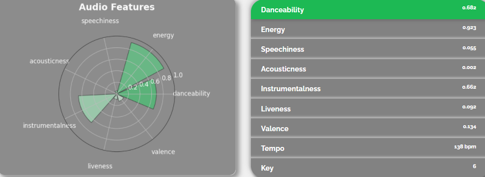

# My Spotify Statistics

My first own side-project (and final project for HarvardX CS50) where I, try to, dive straight into the world of Web Programming. I decided to make a web application which interacts with the Spotify Web API and enables you to analyse your **Spotify 'footprint'**, look up **analysis for any track or own playlist**. As an added bonus I included a tool which automatically **creates a unique playlist** in your Spotify account, based on the top 10 tracks of the artists you like to include in the playlist.

*Note: this web application is built responsively, although viewing it on PC is recommended for UX due to high usage of tables*

## Features

- **Profile Overview**
  - Your display name, user-id, followers, followed, artists, subscription, saved tracks, recently played tracks...
- **Playlist Overview**
  - Total tracks, owner...
- **Track and Playlist Analytics**
  - Danceability, Energy, Speechiness, Acousticness, Valence, Tempo...
- **User Statistics**
  - Top Tracks, Top Artists, Top Genres (on short, middle and long term)
- **Party Planner**
  - Creates a playlist based on the top tracks of of your party guests's top artists
- **Running Tool (under development)**
  - Creates a playlist in 1 or more specific genre(s) based on your required beats per minute (bpm) running cadence
  
## User Authentication
Authentication is done through [User Authentication with OAuth2.0](https://oauth.net/articles/authentication/) with the Authorization Code Flow.

*Note: handling of refresh tokens for extended sessions (> 60mins) has **not yet been implemented**. Due to the nature of this web application this will not result in any problems for users trying out the app for short periods of time.*

## How to run in local environment (Windows users)?
1. Create a virtual environment (eg. with Visual Studio)
2. Set the required environment variables eg. with Windows Powershell after navigating to the local repository where you saved/cloned the project:
   - For example: *C:\Users\frederik\source\repos\My Spotify Statistics\My Spotify Statistics\env> $ENV:FLASK_APP="application.py"*
   - CLIENT_SIDE_URL="http://127.0.0.1:5000" (or any other localhost port)
   - CLIENT_ID (you can create one yourself at the [Spotify for Developers Dashboard](https://developer.spotify.com/dashboard/applications))
   - CLIENT_SECRET (ditto the above)
   - FLASK_APP="application.py"
   - FLASK_ENV="development"
 3. Navigate to the directory which contains the "FLASK_APP" application (usually 1 level up compared to the previous step)
 4. Run the Flask server through eg. *C:\Users\frederik\source\repos\My Spotify Statistics\My Spotify Statistics> flask run*

  
## Technologies & Frameworks
- Python (Flask, Matplotlib)
- HTML, CSS (Bootstrap)
- Javascript (mostly jQuery)

